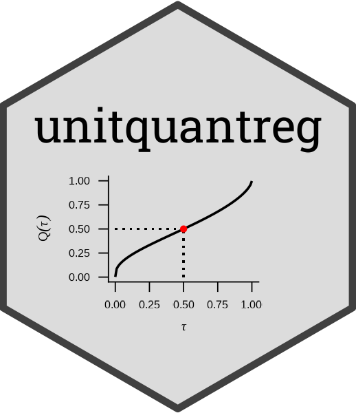

<!-- README.md is generated from README.Rmd. Please edit that file -->

```{r, include = FALSE}
knitr::opts_chunk$set(
  collapse = TRUE,
  comment = "#>",
  fig.path = "man/figures/README__",
  out.width = "90%",
  fig.align = "center",
  dev = "svg"
)
```



## Welcome to `unitquantreg` R package

<!-- badges: start -->
[](https://github.com/AndrMenezes/unitquantreg/actions/workflows/R-CMD-check.yaml)
[](https://app.codecov.io/gh/AndrMenezes/unitquantreg?branch=main)
<!-- badges: end -->

The goal of `unitquantreg` is to provide tools for estimation and inference on
parametric quantile regression models for bounded data.

We developed routines with similar interface as `stats::glm` function,
which contains estimation, inference, residual analysis, prediction, and
model comparison.

For more computation efficient the [`dpqr`]'s, likelihood, score and
hessian functions are vectorized and written in `C++`.

You can install the development version from [GitHub](https://github.com/) with:

```{r, eval=FALSE}
if(!require(remotes)) install.packages('remotes')
remotes::install_github("AndrMenezes/unitquantreg")
```

You can then load the package

```{r, eval=FALSE}
library(unitquantreg)
```

and look at user manuals typing:

```{r, eval=FALSE}
vignette("unitquantreg")
vignette("structure_functionality")
```

## Citation

```{r}
citation("unitquantreg")
```

## License

The `unitquantreg` package is released under the Apache License, Version 2.0.
Please, see file [`LICENSE.md`](https://github.com/AndrMenezes/unitquantreg/blob/master/LICENSE.md).
