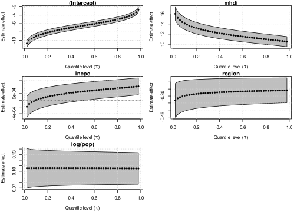

<!-- README.md is generated from README.Rmd. Please edit that file -->

# unitquantreg: An R Package for Estimation and Inference on Parametric Quantile Regression Models for Bounded Data

<!-- badges: start -->
<!-- badges: end -->

The goal of `unitquantreg` is to provide tools for estimation and
inference on parametric quantile regression models for bounded data.

We developed routines with similar interface the `stats::glm` function,
which contains estimation, inference, residual analysis, prediction,
model comparison.

For more computation efficient the dpqr’s, likelihoods, score and
hessian functions are vectorized and coded in `C++`.

The parameter estimation and inference are performed under the
frequentist paradigm. The
[**optimx**](https://cran.r-project.org/web/packages/optimx/index.html)
R package is use, since allows different optimization technique to
maximize the log-likelihood function. The analytical score function are
use in the maximization and the standard errors are computed using the
analytical hessian matrix, both are implemented in efficient away using
`C++`.

## Installation

You can install the development version from
[GitHub](https://github.com/) with:

``` r
# install.packages("devtools")
devtools::install_github("AndrMenezes/unitquantreg")
```

## Example

The distribution families available are:

``` r
lt_families <- list("unit-Weibull" = "uweibull",
                    "Kumaraswamy" = "kum",
                    "unit-Logistic" = "ulogistic",
                    "unit-Birnbaum-Saunders" = "ubs",
                    "log-extended Exponential-Geometric" = "leeg",
                    "unit-Chen" = "uchen",
                    "unit-Generalized Half-Normal-E" = "ughne",
                    "unit-Generalized Half-Normal-X" = "ughnx",
                    "unit-Gompertz" = "ugompertz",
                    "Johnson-SB" = "johnsonsb",
                    "unit-Burr-XII" = "uburrxii",
                    "arc-secant hyperbolic Weibull" = "ashw",
                    "unit-Gumbel" = "ugumbel")
```

The workhorse function is `unitquantreg`, which follows same interface
like `stats::glm`.

``` r
library(unitquantreg)
data(water)
lt_fits <- lapply(lt_families, function(fam) {
  unitquantreg(
    formula = phpws ~ mhdi + incpc + region + log(pop), data = water, tau = 0.5,
    family = fam, link = "logit", link.theta = "log")
})
t(sapply(lt_fits, coef))
#>                                    (Intercept)      mhdi         incpc
#> unit-Weibull                         -6.514485 11.826177  2.600473e-04
#> Kumaraswamy                          -1.625951  4.843166  2.111029e-03
#> unit-Logistic                        -5.365469 10.508100  1.559636e-03
#> unit-Birnbaum-Saunders               -6.556648 13.723681  6.499360e-04
#> log-extended Exponential-Geometric   -4.712735  9.142144  1.928040e-03
#> unit-Chen                            -8.098012 13.560938 -6.162645e-05
#> unit-Generalized Half-Normal-E       -6.598061 11.731146 -1.037014e-04
#> unit-Generalized Half-Normal-X       -5.035562 13.186081  1.580614e-03
#> unit-Gompertz                        -6.260194 11.719934  4.103341e-04
#> Johnson-SB                           -5.993763 11.803290  1.144566e-03
#> unit-Burr-XII                        -5.811837 11.043123  3.777215e-04
#> arc-secant hyperbolic Weibull        -7.363838 12.705584  7.957473e-05
#> unit-Gumbel                          -9.338592 14.990026 -5.503130e-04
#>                                         region    log(pop)  log(theta)
#> unit-Weibull                       -0.26990871  0.10546762  0.17249694
#> Kumaraswamy                        -0.07860323 -0.04727081  1.75778137
#> unit-Logistic                      -0.15826000  0.01773368  0.63005907
#> unit-Birnbaum-Saunders             -0.18081222 -0.02300195  0.00832919
#> log-extended Exponential-Geometric -0.18882479  0.02252007  1.68797084
#> unit-Chen                          -0.48153890  0.19218762 -0.25568492
#> unit-Generalized Half-Normal-E     -0.37220694  0.14224250 -0.18418543
#> unit-Generalized Half-Normal-X     -0.16993805 -0.18341181 -0.38141377
#> unit-Gompertz                      -0.23932329  0.09146941 -5.42477111
#> Johnson-SB                         -0.19500756  0.01823070  0.01748328
#> unit-Burr-XII                      -0.19140000  0.07565710  0.28322367
#> arc-secant hyperbolic Weibull      -0.38168564  0.14972053  0.72098495
#> unit-Gumbel                        -0.62080389  0.25058612 -0.26073820
```

You can use the `likelihood_stats` to get likelihood-base statistics:

``` r
likelihood_stats(lt = lt_fits)
#> 
#>  Likelihood-based statistics of fit for unit quantile regression models 
#> 
#> Call:  likelihood_stats(lt = lt_fits)
#> 
#>                                    Neg2LogLike AIC       BIC       HQIC     
#> unit-Logistic                      -8443.029   -8431.029 -8394.140 -8417.855
#> Johnson-SB                         -8238.405   -8226.405 -8189.516 -8213.232
#> unit-Burr-XII                      -8096.114   -8084.114 -8047.225 -8070.941
#> unit-Weibull                       -7994.077   -7982.077 -7945.188 -7968.903
#> unit-Birnbaum-Saunders             -7955.990   -7943.990 -7907.101 -7930.817
#> unit-Gompertz                      -7808.838   -7796.838 -7759.949 -7783.664
#> arc-secant hyperbolic Weibull      -7679.482   -7667.482 -7630.593 -7654.308
#> log-extended Exponential-Geometric -7677.034   -7665.034 -7628.145 -7651.860
#> unit-Generalized Half-Normal-E     -7496.966   -7484.966 -7448.077 -7471.792
#> Kumaraswamy                        -7188.498   -7176.498 -7139.609 -7163.324
#> unit-Chen                          -7016.542   -7004.542 -6967.653 -6991.368
#> unit-Generalized Half-Normal-X     -6965.962   -6953.962 -6917.073 -6940.789
#> unit-Gumbel                        -6531.775   -6519.775 -6482.886 -6506.602
```

It is also possible to perform pairwise [Vuong
test](https://en.wikipedia.org/wiki/Vuong%27s_closeness_test) to model
selection of nonnested models.

``` r
# Select just a few model to not mess the output
lt_chosen <- lt_fits[c("unit-Logistic", "Johnson-SB", "unit-Burr-XII", "unit-Weibull")]
pairwise.vuong.test(lt = lt_chosen)
#> 
#>  Pairwise comparisons using Vuong likelihood ratio test for non-nested models 
#> 
#> data:  unitquantreg(formula = phpws ~ mhdi + incpc + region + log(pop), 
#>     data = water, tau = 0.5, family = fam, link = "logit", link.theta = "log") 
#> 
#>               unit-Logistic Johnson-SB unit-Burr-XII
#> Johnson-SB    0.00031       -          -            
#> unit-Burr-XII 3.9e-07       0.09659    -            
#> unit-Weibull  8.8e-11       0.00013    0.04868      
#> 
#> P value adjustment method: holm
```

The currently methods implemented for `unitquantreg` objects are

``` r
methods(class = "unitquantreg")
#>  [1] coef         confint      fitted       hnp          logLik      
#>  [6] model.frame  model.matrix plot         predict      print       
#> [11] residuals    summary      terms        update       vcov        
#> see '?methods' for accessing help and source code
```

It is also possible to fit the model for several quantiles values like
`rq` function from
[**quantreg**](https://cran.r-project.org/web/packages/quantreg/index.html)
package.

``` r
fits <- unitquantreg(formula = phpws ~ mhdi + incpc + region + log(pop),
                     data = water, tau = 1:49/50, family = "uweibull",
                     link = "logit", link.theta = "log")
class(fits)
#> [1] "unitquantregs"
plot(fits, which = "coef", mean_effect = FALSE)
```



The currently methods implemented for `unitquantregs` objects are

``` r
methods(class = "unitquantregs")
#> [1] plot    print   summary
#> see '?methods' for accessing help and source code
```
